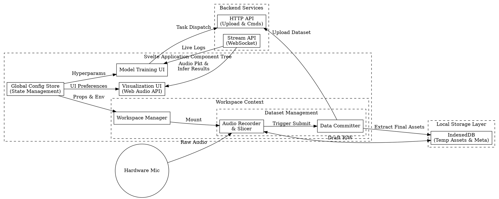

# System Design for Acoustics Lab Frontend

## A. Functional Modules Breakdown

The system can be categorized into the Dashboard Tab (Visualization Module + Configuration Module), Workspace Tab (Workspace Management Module + Dataset Management Module + Model Training Module + Tiny Dashboard Module + History Module), Converter Tab (Tiny Dashboard Module) and Health Monitoring Badge Module:

1. Visualization Module: Responsible for the real-time display of current audio and inference streams. It provides interactive features such as adjusting display parameters, selecting different visualization modes (e.g., waveforms, spectrograms), and rendering inference results (e.g., event categories, confidence scores).

2. Configuration Module: Offers a user interface for global settings that span multiple modules. This includes selecting microphone devices and adjusting inference parameters (e.g., audio overlap ratio, selection of Head weights hot-swap settings).

3. Workspace Management Module: Responsible for managing user workspaces, including creation, deletion, and modification. It ensures the isolation and security of data and model files within each workspace, and logically encompasses the Dataset Management Module.

4. Dataset Management Module: Handles the CRUD of datasets, including audio recording or uploading (e.g. input device selection, from microphone or audio stream, format conversion, clip trimming, etc.), visualization (waveform), playback, slicing (clip into sample segments), and segments visualization (spectrograms, quality analysing), ultimately generating training dataset files consumable by the backend fine-tuning module. Temporarily edited data is cached in the browser using IndexedDB, while finalized data is uploaded to the backend via HTTP API for permanent storage and management.

5. Model Training Module: Provides a user interface for model training operations. This includes configuring hyperparameters (e.g., learning rate, epochs, validation split), initiating the training process, monitoring training status, and viewing training logs (realtime).

6. Tiny Dashboard Module: A lightweight dashboard that provides the functionality of quickly checking the current audio and inference stream outputs, Head weights hot-swaping, as a tiny Dashboard Module. It serves as a quick access point for users to monitor the system's performance without needing to navigate to the full Visualization Module or Model Training Module in the Dashboard Tab.

7. History Module: A module that maintains a historical log of training or converting operations, including timestamps, workspace names, dataset details, training configurations, and outcomes. This allows users to review past activities and results for reference and analysis.

8. Health Monitoring Badge Module: A small badge that displays the current health status of the system, including backend connectivity, inference engine status, and resource usage. Hovering over the badge provides quick access to detailed health information and troubleshooting tips.

### Extra Notes:

1. Dataset Management Module Layout: On the Dataset Management Module Space, category modules should be arranged vertically as rows (list view). Active categories are expanded, while inactive ones are collapsed. The system must support adding and deleting categories; however, the default "Background Noise" category must be persistent and undeletable.

2. Category Module Structure: Expanded category modules are divided into two main areas: left and right (these should stack vertically on mobile devices). The left side is the Input Module Workspace, and the right side is the Slice Management Module Workspace.

3. Input Module Workspace: This workspace should support input device selection, audio recording, audio clip display, and start/end trimming:

    1. Input Device Selection: Allow selection between the browser microphone, device audio streams (with the current streaming device indicated), and drag-and-drop audio file uploads.
    2. Audio Recording (Non-upload mode): After selecting an input device, record single-channel audio. Display a real-time waveform for a specific time window during recording, and show the current recording status and duration in an appropriate position.
    3. Audio Clip Display & Trimming: For recorded or manually uploaded audio clips, use a waveform as the background to represent the length. Provide a range selection bar where users can drag the left and right edges to trim the audio (minimum length: 1s, 44,100 samples). Selected segments should be playable via click.
    4. Other Details:
        - After completing the above steps, users can click a "Slice" button to convert the recorded audio into standard-length slices (1s, 44,100 samples) in the right-side Slice Management Module Workspace. Each conversion acts as an "append" operation (not an overwrite).
        - The Input Module Workspace will only retain the most recent audio clip.
        - The recommended recording sample rate is 48kHz or 44.1kHz. Audio resampling capabilities may be required. Currently, importing formats other than WAV is not supported.
        - Support exporting and downloading completed audio recordings.

4. Slice Management Module Workspace: This workspace must support the display, playback, and deletion of slices, alongside slice quantity and quality checks:
    1. Display: Consider rendering slices as rectangular card elements, using their Spectrogram image as the background fill.
    2. Playback and Deletion: Allow users to click to play or delete a slice.
    3. Quantity and Quality Check: A minimum of 20 slices is required for "Background Noise"; for all other categories, a minimum of 10 slices is required.

5. Overall Frontend-Backend Interaction Flow: Upon loading the Dataset Management Module Space, synchronize the existing categories and recorded clips from the backend. After completing the dataset creation or updates, transmit the data back to the backend based on addition and deletion actions (both categories and slices). During data synchronization, consider displaying a loading animation or implementing a lazy-loading design to reduce the initial data payload.

## B. User Interaction Flow

1. Landing on Dashboard Tab - Upon launching the frontend, users are greeted with the Dashboard Tab, where they can immediately observe the Visualization Module displaying real-time audio and inference streams. The Health Monitoring Badge provides an at-a-glance status of the system's health.

2. Navigating to Workspace Tab - Users can navigate to the Workspace Tab to manage their workspaces and datasets. Here, they can create a new workspace, record or upload audio samples for fine-tuning, and manage these samples through playback, slicing, and deletion. Once the dataset is prepared or updated, users can sync it to the backend for training.

3. Model Training - After submitting the dataset or updating existing datasets, users can scroll to the Model Training Module to configure hyperparameters and initiate the training process. The module provides real-time updates on training status and logs, allowing users to monitor progress and troubleshoot if necessary. Note also consider providing useful informations, e.g. there's already have a trained Head weight and it revision matches the current dataset, do you want to skip training and directly hot-swap the Head weight for inference?, etc.

4. Quick Monitoring - At any point, users can utilize the Tiny Dashboard Module for a quick check of the current audio and inference stream outputs, as well as to perform quick hot-swapping of Head weights without needing to navigate away from their current workspace or training session.

5. Reviewing History - Users can access the History Module to review past training or converting operations, allowing them to analyze previous configurations and outcomes for better decision-making in future operations.

6. Converter Tab - For users needing to convert model formats, they can navigate to the Converter Tab, which provides a streamlined interface for selecting source and target formats, uploading model files, and initiating the conversion process. The Tiny Dashboard Module can also be utilized here for monitoring conversion status and outputs. Note the converter tab actully automatically create a workspace with a special name and tag, the name should be preserved for Workspace Management and History Module, but the workspace itself is hidden from user in Workspace Tab, and only visible in Converter Tab, also supporting quick access to the converted model files for download or direct hot-swap in inference, and manual freeup the workspace after conversion.

7. Error Handling and Feedback - Throughout the user interaction flow, the system provides appropriate feedback and error handling mechanisms. For instance, if there are issues with audio recording, dataset submission, or training initiation, the system should provide clear error messages and guidance on how to resolve these issues.

## C. Design Considerations

1. Design Goals: This design scheme aims to provide a user-friendly, logically clear, and fully functional frontend interface for local fine-tuning. It requires deep architectural consideration regarding data affinity and performance optimization (e.g., ensuring zero-latency playback of dataset audio). This allows users to effortlessly conduct fine-tuning training for acoustic events and immediately observe and validate the results, thereby elevating overall system performance and user experience.

2. UX and Error Handling: Each step in the workflow above requires the system to provide appropriate guidance and feedback. This ensures users can smoothly complete the fine-tuning process while clearly understanding the purpose and operational methods of each phase. Additionally, the system must incorporate robust error handling and exception feedback mechanisms to assist users in resolving any issues encountered during operation.

3. Core Design Principles:
    1. Consistency & Conventions
        - Maintain absolute uniformity in visual elements (colors/typography/spacing) and interactions (identical components must exhibit identical behaviors).
        - Adhere to established industry conventions; do not reinvent the wheel (e.g., clicking the top-left logo returns to the homepage).
    2. Instant & Clear Feedback
        - Every interactive action (Hover/Click/Loading/Success/Error) must yield visual or textual feedback within a reasonable timeframe (e.g., under 400ms).
        - Never leave the user guessing about the system's current state.
    3. Visual Hierarchy & Whitespace
        - Align layouts with natural scanning behaviors (F-pattern or Z-pattern). Call-to-Action (CTA) elements must carry the highest visual weight.
        - Utilize whitespace (rather than structural lines) to divide information blocks. Apply the Gestalt principle of proximity to group related elements together.
    4. Simplicity & Hick's Law
        - Maximize the signal-to-noise ratio by removing all non-essential decorations.
        - Manage high information density by employing progressive disclosure or step-by-step wizards.
    5. Forgiveness & User Control
        - Provide "emergency exits": modals must be easily dismissible, high-risk actions should be reversible (Undo), and proactive constraints should prevent errors before submission.
        - Error messages must be constructive and conversational. Explain what went wrong in plain language and offer clear, actionable solutions.
    6. Clear Affordances & Signifiers
        - UI elements must "look like what they do." Buttons should appear clickable, links must be visually distinct, and critical features should not be buried behind complex hovers or deep menus.
    7. Accessibility (a11y)
        - Ensure text-to-background contrast ratios strictly meet WCAG standards.
        - Interfaces must fully support keyboard-only navigation (`Tab`, `Enter`, `Space`) with highly visible focus states.
        - Prioritize semantic HTML tags (e.g., `<nav>`, `<button>`, `<dialog>`) and appropriate ARIA attributes for screen readers.

## D. Architectural Considerations

1. Technology Stack Recommendations: Regarding the frontend technology stack, it is recommended to use the Svelte framework paired with Tailwind CSS to leverage its highly efficient component-based development paradigm and reactive characteristics. This should be combined with the Web Audio API for audio processing and visualization, IndexedDB for local data storage, and the Fetch API for backend data interaction. Furthermore, a modular code structure is recommended to ensure clear separation of concerns among functional modules and maintain high maintainability.

2. Project Pacing: We have ample time to make perfect decisions; we will proceed step-by-step, conduct thorough in-depth research, and formulate correct and reasonable plans.

3. Future-proofing: The design should be flexible and extensible to accommodate future enhancements, such as additional visualization modes, support for more complex training configurations, or integration with other backend services. This ensures that the frontend can evolve alongside the backend and continue to meet user needs effectively.

4. Performance Optimization: Given the real-time nature of audio processing and inference visualization, performance optimization is crucial. This includes efficient handling of audio data, minimizing latency in visualization updates, and ensuring smooth user interactions even during intensive operations like training.

5. Extra context:
    1. Keep the design slim, simple and intuitive, keep codespace clean, tidy, no docs required.
    2. Ensure that the frontend is responsive and works well across different devices and screen sizes.
    3. Prioritize user experience by providing clear feedback, easy navigation, and helpful error messages throughout the application.
    4. Consider security implications, especially when handling user data and interactions with the backend, ensuring that appropriate measures are in place to protect user information and maintain system integrity.
    5. No need for testing or benchmarking considerations in the frontend design, the web frontend project should be compact, small, slim and efficient.
    6. No need for CI/CD pipeline considerations, no need for tracking, it mainly a static webpage.
    7. Futher stage requires Light/Dark mode support, and internationalization (i18n) support, but we can defer these to later stages after the core functionalities are implemented and stabilized.
    8. We have a lot of time to make perfect decisions, we will proceed step-by-step, conduct thorough in-depth research, and formulate correct and reasonable plans
    9. Backend APIs located in `docs/API.md`, with other backend design details in `docs/`.
    10. Use latest SvelteKit with Vite, and Tailwind CSS for rapid UI development, write top-tier, idiomatic, clean, maintainable code with best practices in mind, and ensure the architecture is modular and scalable for future enhancements.
    11. Double check for correctness, efficiency, robustness and consistency, and ensure the design adheres to the core design principles outlined above.

## E. System Architecture Diagram (DOT format):

## F. Dataset Sync Mechanism

The Dataset Management Module's sync layer is content-addressed and revision-gated. The design optimises for the common case where the operator's local IDB already reflects the daemon's state (page refresh, workspace switch back-and-forth, idle polling) by eliminating per-category dataset GETs in that path. It also enforces strict laziness for the expensive operations (WAV download + FFT render) so a workspace with hundreds of slices doesn't burn bandwidth + CPU on cards the operator never looked at.

### F.1. Content-addressed identity

Every slice's canonical identity is the SHA-256 of its WAV bytes (lowercase hex, computed via `crypto.subtle.digest` at slice production time). The same string is:

- The daemon-side filename basename: `<sha>.wav`.
- The IDB `slices` primary-key suffix (composite `[workspace_id, category_name, id]` — the composite admits the same content in two categories).
- The `spectrograms` cache key (shared across categories and workspaces; same content yields one rendered PNG).
- The in-memory blob cache key (per-tab session).

The daemon's PUT receipt's `sha256` MUST equal our pre-computed id; a mismatch is treated as an upload failure. Downloaded bytes are also verified post-fetch (sha256 of received bytes vs the slice id) before reaching any cache. `sliceIdFromFilename` strictly validates `^[0-9a-f]{64}$`; non-conforming foreign-named files on the daemon are silently skipped during reconcile (their bytes would fail the integrity check anyway).

### F.2. Three-tier sync hierarchy

**Tier 1 — workspace-revision short-circuit (steady state; zero dataset GETs).** A persisted `workspace_sync` IDB row holds `last_synced_revision_id` per workspace. On workspace mount, the page compares the freshly-fetched `detail.workspace_revision.id` to this record (via an in-memory mirror, `lastSyncedRevisions`, that's read from IDB once per session). When `synced >= workspaceRevision`, the per-category dataset GETs are skipped entirely — the UI renders straight from IDB. The `>=` (rather than `===`) admits the case where our auto-advance (see F.4) bumped the mirror past the page's last-known detail rev.

**Tier 2 — per-category index reconcile (cheap; only on revision advance, first visit, or explicit force).** Concurrency-capped (3 categories at once) fan-out of `GET /assets/datasets/<cat>`. Pure set-difference rules on filenames:

- committed-local + filename in daemon listing → no-op (same content by construction).
- committed-local + filename absent → orphan; drop the row (only when the listing call succeeded — a failing listing leaves IDB alone).
- `local | uploading | failed` → preserve always (no daemon presence by definition).
- daemon-only file with sha-shaped basename → synthesise a committed row.

Successful workspace-wide reconcile persists `workspace_sync` to `max(workspaceRevision, currentMirror)` — never regressing past a value already advanced by auto-advance. The next mount's Tier 1 short-circuit then hits.

**Tier 3 — lazy materialisation on visibility (the WAV + FFT cost).** Slice bytes and spectrograms are fetched only when a `SliceCard` becomes visible. A single grid-rooted `IntersectionObserver` (with a `64px` rootMargin pre-fetch buffer) populates a `visibleIds` set; each card debounces its fetch trigger by 150 ms so fast-scroll transits don't queue work the operator never paused on. Concurrency caps: 6 simultaneous WAV downloads, 3 simultaneous FFT renders. Cached spectrograms (PNG blobs) live in IDB keyed by sha256 and are valid forever per content hash — no invalidation logic needed (different bytes produce a different hash, hence a different cache row).

### F.3. Workspace poller

A 2 s tick fetches `GET /workspace/{id}` while the page is visible. It compares the daemon's `workspace_revision.id` to the persisted `workspace_sync` value (via the in-memory mirror — NOT against `latestRevisions`, which the poller bumps itself and would silently mask failed reconciles). On advance, it flips per-category stale bits AND fires a background Tier 2 reconcile. Failed or in-flight-blocked reconciles leave the persisted value behind the daemon, so the next tick retries until success.

Three short-circuit gates skip a tick without a daemon round-trip:

- `document.hidden` (background tab); resumes on `visibilitychange` with an immediate tick.
- `slices.mutationsInFlightFor(id) > 0` (operator is uploading/deleting — our own mutations would false-positive against pre-receipt store state).
- Single-flight `fetching` flag (a slow daemon tick doesn't pile up concurrent fetches).

### F.4. Auto-advance on local commits

When a local upload's receipt rev equals `lastSyncedRevisions[ws] + 1`, our upload is provably the only daemon-rev-advancing event between `synced` and `receipt.rev` (the daemon's rev counter is sequential and monotonic). The mirror advances atomically and a fire-and-forget `putWorkspaceSync` persists the new value. The strict `+1` check is multi-tab-safe: if a concurrent external upload landed first, our receipt rev jumps past `+1`, the check fails, and we fall back to the poller-driven reconcile to discover the external delta. The optimisation eliminates the redundant Tier 2 reconcile that the poller would otherwise fire after every local commit (since `incoming > synced` would be true until reconcile catches up).

### F.5. Robustness guarantees

- **Mirror, IDB, and `latestRevisions` are jointly monotonic.** Every writer flows through `setLastSyncedAtLeast` / `setRevisionAtLeast`. The reconcile's IDB write uses `max(workspaceRevision, mirror)` so a stale-rev reconcile (caller's prop lagged auto-advance) doesn't regress the persisted record.

- **Forget-race guards.** Every `await` in `refresh` / `reconcileWorkspace` is followed by a `lists.has(k)` (or `workspacesLoaded.has(workspaceId)`) check before any in-memory or IDB write that would resurrect a workspace currently being wiped.

- **In-memory merge on refresh.** The per-category refresh captures a `startIds` snapshot before its awaits and merges the reconciled result with the live in-memory state at the end. Appends, deletes, and state transitions that landed during the await window are preserved — the operator's just-sliced row stays visible even when a poll-driven reconcile fires concurrently. Synthesise is dedup'd by `seenFilenames` populated from every kept row (not just committed-matched), so a local row whose content also exists on the daemon doesn't produce a duplicate-id row.

- **`AbortController` at enqueue time.** The upload pipeline's controller is created when `enqueueUpload` is called (not when `runUpload` actually dispatches), so a `delete()` that lands while the upload is still queued can abort it before it gets a pool slot. Identity-checked cleanup at the wrapper's `finally` ensures a re-enqueue after delete doesn't cross-clobber the successor's entry.

- **Recursion catch-up.** When `reconcileWorkspace` completes successfully, it checks if `latestRevisions > succeededAt` (where `succeededAt` is captured AFTER the put-await to reflect any auto-advance bumps that landed during it). If so, recurse with the live category set and the newer rev — without waiting for the next poller tick. The post-await read suppresses redundant recursion when our own auto-advance closed the gap.

- **No content-addressed cache eviction on per-slice delete.** Spectrogram and blob caches are keyed by content hash; another slice anywhere may still rely on the entry. The cache grows linearly with unique content hashes seen in the session (~3-4 KB per spectrogram PNG); `resetDB` is the single reset point.

### F.6. Error handling

- Daemon listing 5xx → refresh's catch preserves in-memory state, flips the loading flag, sets an error message on the per-category list. Next refresh trigger retries.
- Daemon listing 404 → treated as empty (operator added the category but hasn't uploaded a slice yet).
- Spectrogram render failure → SliceCard logs the warning, renders without an image. Scrolling away and back triggers a fresh attempt (the cache was never populated).
- Daemon returns bytes with sha mismatch → throw from `getSliceBlob`; SliceCard handles the same as a render failure.
- IDB write failure on bulk ops → caught and swallowed at the call site; the in-memory list remains authoritative until the next refresh re-attempts.

### F.7. IDB schema

| Store | Key | Purpose |
| --- | --- | --- |
| `categories` | `[workspace_id, name]` | Operator-added categories not yet materialised on the daemon (empty dirs aren't listed by the daemon). |
| `drafts` | `[workspace_id, category_name]` | Single in-progress clip per category (Input Module retains only the most recent). |
| `slices` | `[workspace_id, category_name, id]` | Per-slice records; `id` = sha256 hex of WAV bytes; composite key admits same content in two categories. |
| `workspace_sync` | `workspace_id` | `last_synced_revision_id` per workspace; powers the Tier 1 short-circuit. |
| `spectrograms` | `sha256` | Cached PNG bytes, shared across categories + workspaces by content hash. |

Workspace delete cleans the workspace's own rows in `categories` / `drafts` / `slices` / `workspace_sync`. `spectrograms` is intentionally not workspace-scoped (content-addressed, may be referenced by other workspaces) — `resetDB` is the only operation that wipes it.
